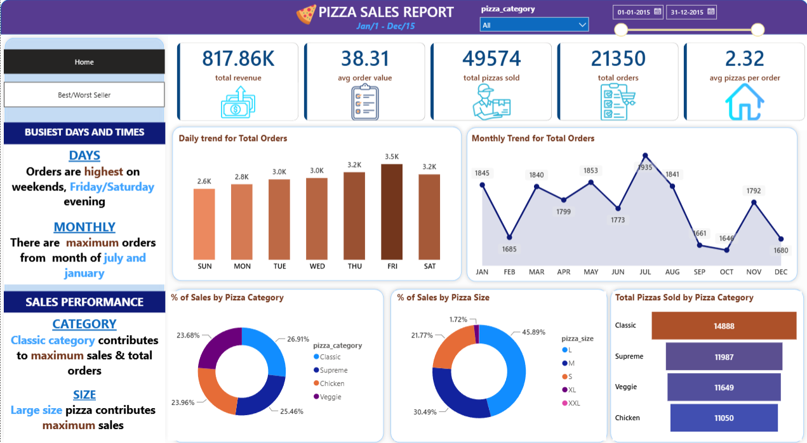
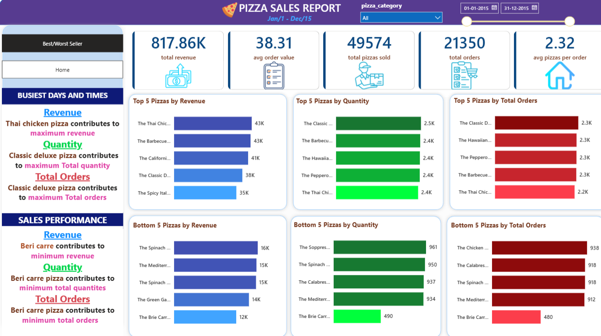

# 🍕 Pizza Sales Dashboard

## 📌 Overview
An interactive Pizza Sales Dashboard built using Power BI, SQL, and Microsoft Excel to analyze sales performance, customer purchasing behavior, and product trends.

## 🛠 Tools Used
- Power BI
- SQL
- Microsoft Excel

## 📈 Key KPIs
- Total Revenue: **817.86K**
- Total Orders: **21,350**
- Total Pizzas Sold: **49,574**
- Average Order Value: **38.31**
- Average Pizzas per Order: **2.32**

## 📊 Dashboard Preview

### Home Dashboard

### Best & Worst Seller Dashboard

## 🔍 Key Insights
- Generated **817.86K** in total revenue from **21,350** orders.
- Sold **49,574** pizzas with an average of **2.32 pizzas per order**.
- Identified the top 5 and bottom 5 pizzas by revenue, quantity sold, and total orders.
- Analyzed daily and monthly sales trends.
- Compared sales across pizza categories and sizes using interactive filters.

## 📂 Repository Contents
- Pizza-Sales-Dashboard.pbix
- dashboard-home.png
- dashboard-best-worst.png
